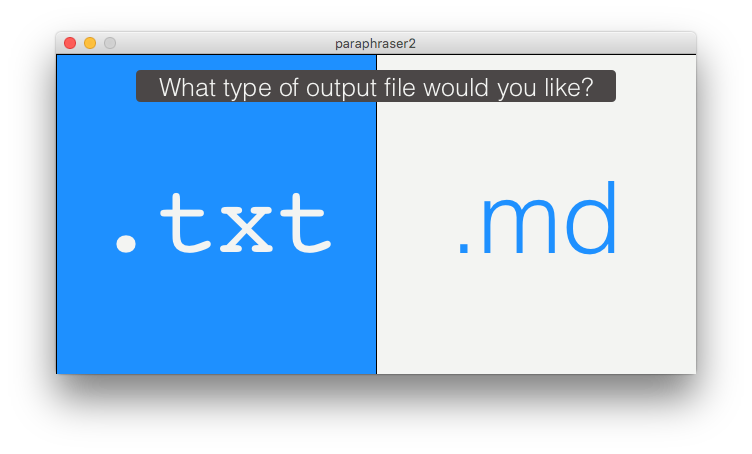
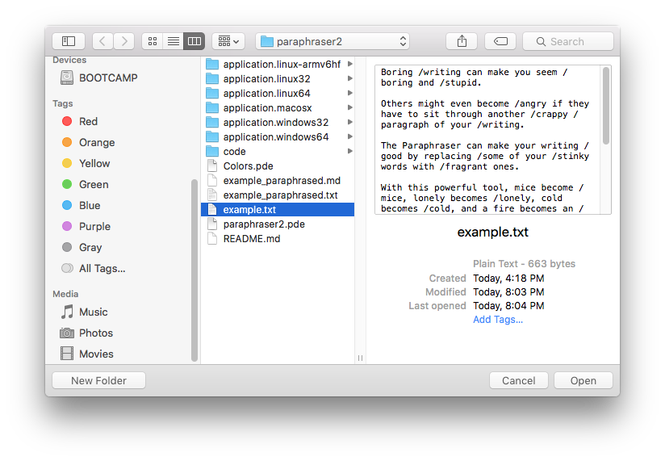
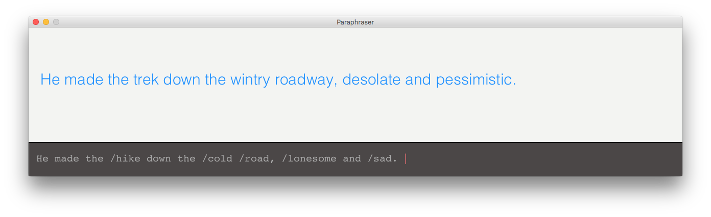

# Paraphraser2

### A more robust extension of the [Paraphraser](https://github.com/mdgriest/Paraphraser) GUI, by [Mitchell Griest](mailto:mdgriest@crimson.ua.edu)

# What it does

The Paraphraser takes in a .txt file and reads it word by word. Words that start with a `/` are automatically replaced with their most relevant synonym, as provided by [Thesaurus.com](http://www.thesaurus.com/).

Paraphraser2 allows you to choose between .txt and .md (Markdown, which can easily be converted to beautiful PDFs or HTML documents using tools like [MacDown](http://macdown.uranusjr.com/) or [StackEdit](https://stackedit.io/)) for your output file type, and shows you the original text side by side with the paraphrased text.

# How to use it

You can run the application using the application file for your system (for example, `application.macosx` for Mac users), or by running the `Paraphraser2.pde` sketch directly in [Processing](https://processing.org/).

When Paraphraser2 opens, you will see two large, simple buttons asking what type of file you would like for the output.

Select an output type, and you will see a window asking you which .txt file you would like to paraphrase.

Paraphraser2 will quickly paraphrase the .txt file you specified and place the new version in a brand new file. For example, `myStory.txt` becomes `myStory_paraphrased.txt`.

If you choose the .md option, Paraphraser2 will even **bold** the words that it changed, so you can quickly scan over the document and see what's changed.

# That's it

If you like the idea of Paraphraser2 but are looking for something less complex, try the original [Paraphraser](https://github.com/mdgriest/Paraphraser), which automatically converts the text as you type and makes a great teaching tool!

These projects are free and open-source, so please let me know what neat ways you are finding to use them! Feedback, stories, and suggestions for future features are always welcome at [mdgriest@crimson.ua.edu](mailto:mdgriest@crimson.ua.edu).

Very best,

[Mitchell Griest](https://github.com/mdgriest)
